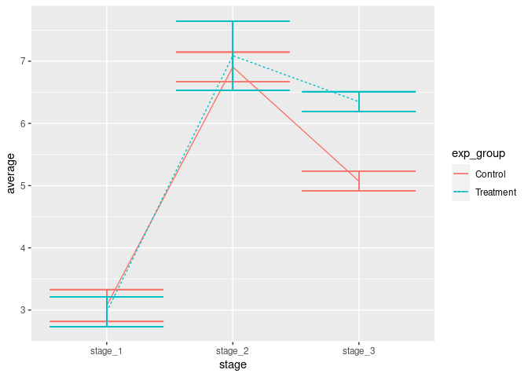

## About the Data

Our data typically exists in data frames. Imagine that we have fluorescence data coming from 10 experiments (5 control + 5 treatment) that are biological replicates measured at 3 time points. 
We are interested in the average and the standard error of this data in the control and treatment groups.


```r
library(ggplot2)
library(reshape2)
library(dplyr)
```


```r
sample_df_short
```

```
##     experiment  stage_1  stage_2  stage_3
## 1    Control_1 2.854248 7.049660 5.195314
## 2    Control_2 2.945699 6.690002 4.662059
## 3    Control_3 3.184249 6.723853 5.368887
## 4    Control_4 3.969561 6.325949 4.990377
## 5    Control_5 2.408587 7.745829 5.053115
## 6  Treatment_1 2.714928 7.411316 5.721287
## 7  Treatment_2 2.201510 7.684957 6.058823
## 8  Treatment_3 3.586637 4.932745 6.038084
## 9  Treatment_4 3.314180 8.121539 6.326929
## 10 Treatment_5 3.045386 7.294482 5.668027
```

### Data Preparation

We need to put our data frame to longer format and then compute the average and the standard error.


```r
sample_df = melt(sample_df_short, id = c("experiment"))

colnames(sample_df) = c( "experiment", "stage", "fluorescence" )
```


```r
   sample_df[1:6,]
```

```
##    experiment   stage fluorescence
## 1   Control_1 stage_1     2.854248
## 2   Control_2 stage_1     2.945699
## 3   Control_3 stage_1     3.184249
## 4   Control_4 stage_1     3.969561
## 5   Control_5 stage_1     2.408587
## 6 Treatment_1 stage_1     2.714928
```

Next we label experiments as "Control" and "Treatment". Pay attention to the 
"unlist" function. Lists will cause issues with ggplot. Converting these labels to vector is necessary.


```r
sample_df = sample_df %>% 
  mutate( exp_group = unlist(lapply( strsplit(experiment, split = "_"), "[[", 1 ) )  )
```


```r
compute_se <- function(x) sqrt(var(x)/length(x))
# Now we can add average and standard error (se) to the table

sample_df = sample_df %>%
  group_by(exp_group, stage) %>%
  mutate(average = mean(fluorescence)) %>%
  mutate(se = compute_se(fluorescence) )

sample_df[1:6,]
```

```
## # A tibble: 6 x 6
## # Groups:   exp_group, stage [2]
##   experiment  stage   fluorescence exp_group average    se
##   <chr>       <fct>          <dbl> <chr>       <dbl> <dbl>
## 1 Control_1   stage_1         2.85 Control      3.07 0.257
## 2 Control_2   stage_1         2.95 Control      3.07 0.257
## 3 Control_3   stage_1         3.18 Control      3.07 0.257
## 4 Control_4   stage_1         3.97 Control      3.07 0.257
## 5 Control_5   stage_1         2.41 Control      3.07 0.257
## 6 Treatment_1 stage_1         2.71 Treatment    2.97 0.241
```

## Plotting with the Defaults

First, we attempt to plot the data with the minmal code.


```r
ggplot(data = sample_df,
       aes( x = stage, y = average, group = exp_group ) ) + 
  geom_line( aes(linetype = exp_group, color = exp_group) ) + 
  geom_errorbar( aes(ymin=average-se, ymax= average + se, color = exp_group) )
```

<!-- -->

This plot is clearly NOT publication ready.

In the remaining of this document, we make this plot publication ready and save it.

### Have Your Parameters in One Place

For projects involving many figures, it is a good idea to 
have the parameters of the plot (colors, font size etc.) in one place.
This way, making changes in the project / manuscript are easier and consistent.


```r
TREATMENT_COLOR = "#bf5700"
CONTROL_COLOR   = "#005f86"

FONT_LABEL_SIZE = 8
FONT_TITLE_SIZE = 10
FIGURE_FONT     = "helvetica"

AXIS_THICKNESS  = 0.35

PDF_RESOLUTION = 600
```

### Error Bars

First, we fix the error bars. 
They overlap, so we use `position_dodge` to put them apart.
Also we can fix their size.


```r
line_plot = 
  ggplot(data = sample_df,
       aes( x = stage, y = average, group = exp_group ) ) + 
  geom_line( aes(linetype = exp_group, color = exp_group) ) + 
  geom_errorbar( aes(ymin=average-se, ymax= average + se, color = exp_group),
                 position = position_dodge(width = 0.15), width = 0.4, size = 0.4 )

print(line_plot)
```

<!-- -->

### Labels and Colors


```r
line_plot = line_plot +
   scale_linetype_manual(values=c("solid", "dashed")) + 
   scale_colour_manual(values = c(CONTROL_COLOR, TREATMENT_COLOR)   ) + 
   labs(title = "Protein Abundance", y = "Fluorescence", x = "Stage") + 
   scale_x_discrete( labels = c("stage 1", "stage 2", "stage 3"),  expand = c(0.1, 0.1)) +
   ylim(c(3,8)) +
   scale_y_continuous( breaks = 3:8, labels = 3:8, expand = c(0.1,0)) 

   
   
print(line_plot)
```

<!-- -->


### Legend, Theme & Axis


```r
line_plot = line_plot +
      theme(
      panel.border      = element_blank(),
      panel.grid        = element_blank(),
      plot.title        = element_text(hjust = 0.5, family = FIGURE_FONT, face = "plain", size = FONT_TITLE_SIZE),
      panel.background  = element_blank(),
      axis.text.y       = element_text(family = FIGURE_FONT, face = "plain", size = FONT_LABEL_SIZE),
      axis.text.x       = element_text(family = FIGURE_FONT, face = "plain", size = FONT_LABEL_SIZE),
      axis.title.y      = element_text(family = FIGURE_FONT, face = "plain", size = FONT_LABEL_SIZE),
      axis.title.x      = element_text(family = FIGURE_FONT, face = "plain", size = FONT_LABEL_SIZE),
      legend.position   = c(0.8, 0.2),
      axis.line         = element_line(colour = "black", size = AXIS_THICKNESS), 
      legend.title      = element_blank(),
      legend.text        = element_text(family = FIGURE_FONT, face = "plain", size = FONT_LABEL_SIZE),
      legend.key.size    = unit(0.15, units = "in") 
    ) 

   
print(line_plot)
```

<!-- -->

## Saving the Plot

Finally, we can save this plot in pdf format.
Please pay attention to the dimensions of your figure.
You may need to adjust the parameters after looking at the pdf at %100 scale or after printing your figure.


```r
save_plot_pdf = function(filename, this_plot, width = NA, height = NA){
  ggsave(filename, 
           plot   = this_plot, 
           device = cairo_pdf, 
           width  = width,
           height = height,
           dpi    = PDF_RESOLUTION )
}

save_plot_pdf("line_plot.pdf", line_plot, width = 2.35, height = 2.35)
```

## Tips

  * SAVE YOUR PLOTS IN PDF FORMAT (there are a few exceptions).
  * Have your plot in an object (in pur case it is `this_plot`).
  * Have your parameters in one place (file or in the beginning of the script)
  * Decide on the pdf dimensions and see the pdf file in %100 scale to decide on the parameters.

