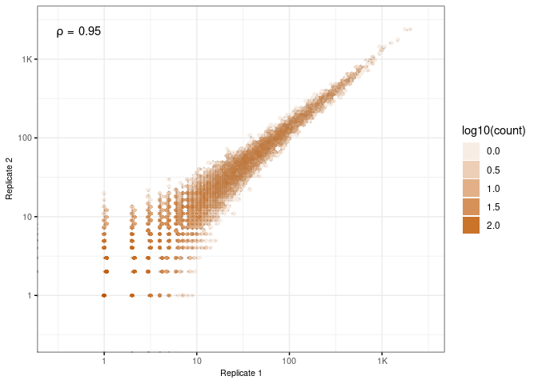

  


```r
library(ggplot2)
library(ggpubr)
library(reshape2)
library(dplyr)
library(ribor)
```

## Data

Our data comes from a ribo file. We read the number reads mapping to CDS into a dataframe.


```r
ribo_file_path = "../sample.ribo"
myribo         = Ribo(ribo_file_path, rename = rename_default)

rc <- get_region_counts(myribo,
                                   range.lower = 28,
                                   range.upper = 35,
                                   length      = TRUE,
                                   transcript  = FALSE,
                                   tidy        = FALSE,
                                   alias       = TRUE,
                                   region      = c("CDS"), 
                                   compact     = FALSE)

rcw = dcast(rc, transcript ~ experiment)  
```

## Constants


```r
BURNT_ORANGE = "#bf5700"
UT_BLUE      = "#005f86"

MOUSE_MIN_LENGTH = 29
MOUSE_MAX_LENGTH = 35

FONT_LABEL_SIZE = 8
FONT_TITLE_SIZE = 9

PDF_resolution = 600
FIGURE_FONT    = "helvetica"


ribo_orange = rgb(228,88,10 , maxColorValue = 255)
rna_blue    = rgb(55,135,192, maxColorValue = 255)
```

## Function Definition

id_1 and id_2 are the names of the experiments in the ribo file. You can rename them in the xlab and ylab parameters.
num_bin is the number of bins the data is partitioned x and y directions.


```r
plot_pairwise_relationships = function (counts_w, 
                                        id1, id2, 
                                        xlab    = "", 
                                        ylab    = "", 
                                        num_bin = 52, 
                                        xrange  = 100000, 
                                        yrange  = 100000  ) { 
  
  my_text_element = element_text(family = FIGURE_FONT, face = "plain", size = FONT_LABEL_SIZE)
  
  sp = ggscatter(counts_w, x = id1, y = id2,
                 #                add = "reg.line", conf.int = FALSE,     
                 #                add.params = list(color = "blue", size = 0.5),
                 font.family = "Helvetica", 
                 size        = 0.2,
                 color       = "gray", 
                 alpha       = 0.4, 
                 ggtheme     = theme_bw()) 
  
  formatted =   sp +   
    scale_x_log10(labels = scales::label_number_si(), limits = c(0.3, xrange)) +   
    scale_y_log10(labels = scales::label_number_si(), limits = c(0.3, yrange)) + 
    labs (x=xlab, y = ylab) +
    stat_cor(method        = "spearman", 
             aes(label     = ..r.label..), 
             cor.coef.name = "rho", 
             digits        = 2)  + 
    geom_hex(bins= num_bin, aes(alpha=log10(..count..) ), fill="#bf5700" ) +
    theme( axis.text.x      = my_text_element,
           axis.title.x     = my_text_element,
           axis.text.y      = my_text_element,
           axis.title.y     = my_text_element,
           plot.title       = my_text_element
    )
  return (formatted)  
}
```

## Sample Plot

For your case, try different values of xrange, yrange and number of bins.


```r
plot_pairwise_relationships(rcw, 
                            "20191203-Kit-10M-Monosome-1", 
                            "20191203-Kit-10M-Monosome-2", 
                            xrange = 3000, yrange = 3000, num_bin = 80,
                            xlab = "Replicate 1", ylab = "Replicate 2")
```

<!-- -->
